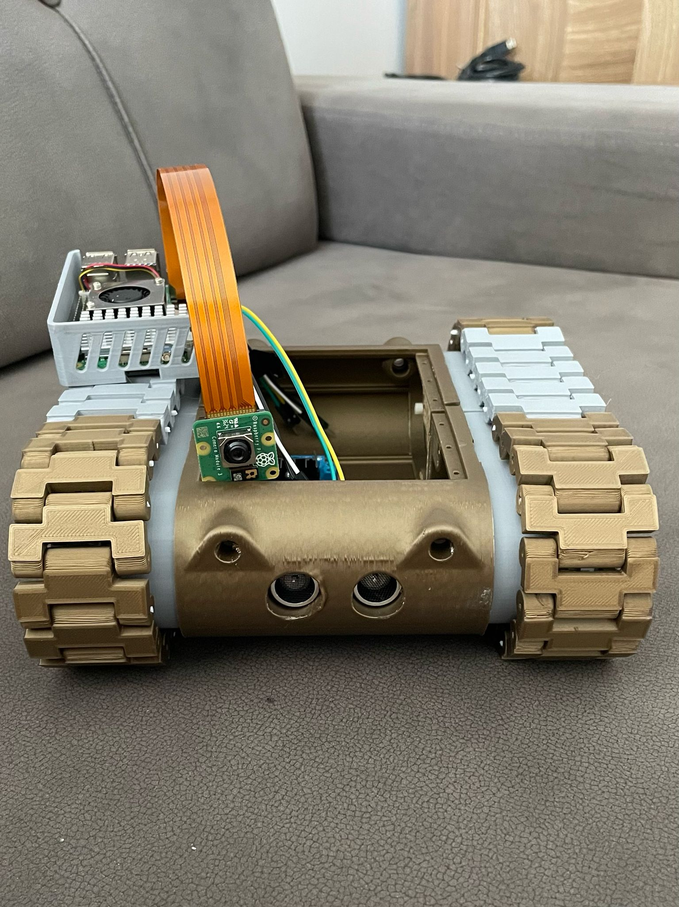
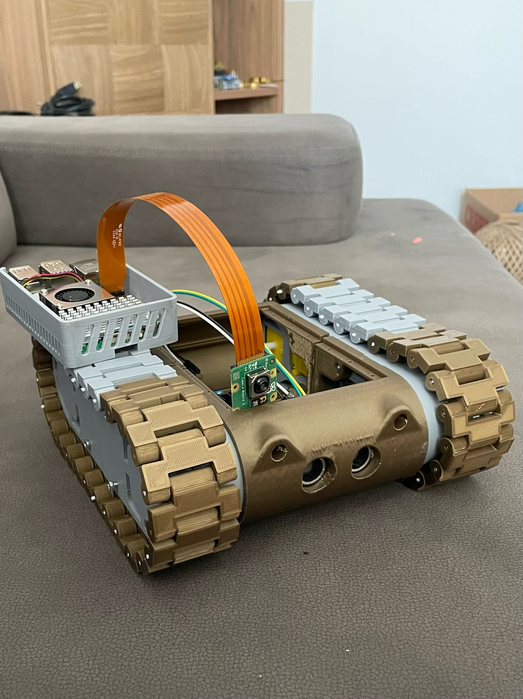
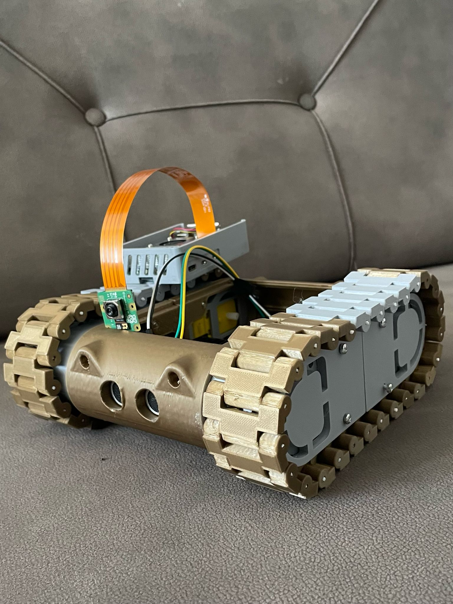

# 🔥 Autonomous Firefighting Tank

##  Project Description
This project aims to develop an **autonomous tank platform capable of rapid response to fires**. The tank is equipped with a **camera module, GPS, motors, and fire detection sensors**. Within the scope of the project, the tank will **detect fires in forested areas and move to the target location based on provided coordinates to intervene**.

##  Technologies Used
- **Raspberry Pi 5** (Main control unit)
- **Camera Module** (Fire detection and environmental analysis)
- **GPS Module** (Location tracking and target navigation)
- **Motor Driver and DC Motors** (Tank movement mechanism)
- **Sensors** (Fire detection, temperature, and smoke sensors)
- **Artificial Intelligence** (Fire detection through image processing)
- **Python & OpenCV** (Image processing and control mechanisms)

##  Project Objectives
1. **Fire Detection:** Creating an **AI-powered** fire detection system using data from cameras and sensors.
2. **Autonomous Movement:** Directing the tank to specific coordinates using **GPS and navigation systems**.
3. **Fire Intervention:** The tank will reach the designated fire area and **extinguish fires using a water spray or chemical suppression system**.

##  Features
✅ **Autonomous Navigation**: Uses GPS and mapping data to **reach the target location via the optimal route**.  
✅ **Real-Time Image Processing**: Utilizes OpenCV and AI to **detect fires**.  
✅ **Remote Control**: Allows **manual operation** when needed.  
✅ **Durable Design**: Built with a **sturdy chassis and motor system** to withstand harsh conditions.  
✅ **Fire Suppression Mechanism**: Integrated **water spray or chemical fire suppression system**.  

##  Images

##  Contribute
To contribute to this project, you can create a **pull request** or open an **issue** with your suggestions.

---
 **Project Owner**: Onurhan Akbulut  
 **Contact**: onurhanakbulut.ai@gmail.com
